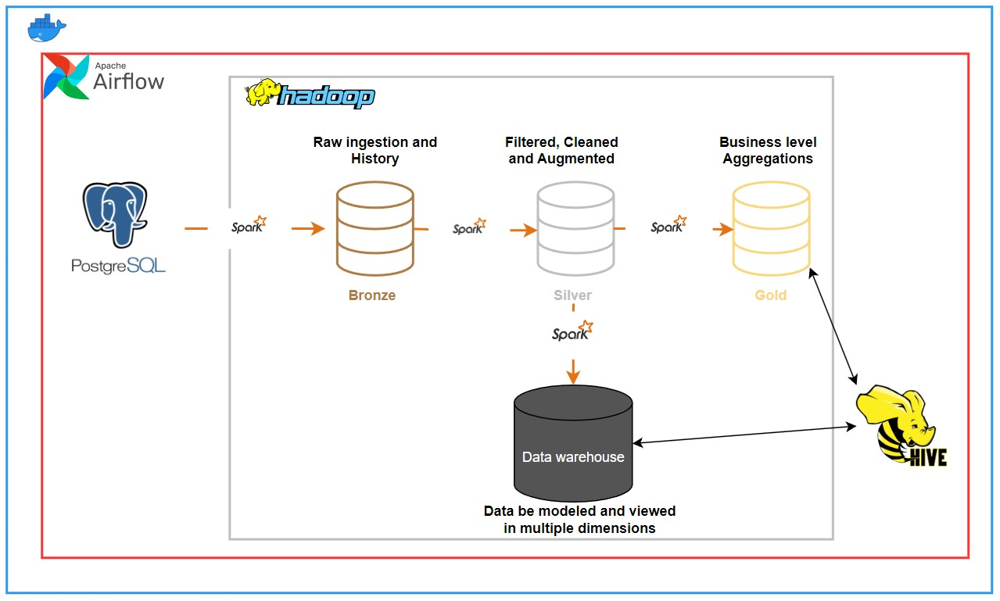

# Flights Etl Pipeline

I cooked up this project to get some hands-on experience with big datasets and putting together a simple ETL process. The data I played with, you can find it on Kaggle, is a bulky 30GB. After wrapping this project up, I bagged some pretty cool insights and skills on dealing with big data.

## 1. Introduction

In all my years, I've never had the opportunity to take flight aboard an airplane. The main reason being the significant dent it would put in my budget. Flying is a luxury I've found to be quite expensive, and it's been a hurdle that's kept me grounded. Moreover, I have to concerned about unfortunately accidents

This is the chance for me to explore deeper into the workings of the flight industry. This is where the project begins.


## 2. Dataset

Dataset with **30GB** size is collected from [Kaggle](https://www.kaggle.com/datasets/dilwong/flightprices/data).

## 3. Design

### 3.1 Directory tree

    .
    ├── docker                   # Include self-built docker images (hadoop, spark, airflow, ...)
    ├── images                   # Images use for readme file
    ├── mnt                      # Source files to config pipeline in airflow
    │   ├── benchmarks/dags      # DAGs are defined as Python code
    ├── scripts                  # Inluce files for testing and loading data to postgres
    ├── docker-compose.yaml      # To compose docker containers
    ├── reset.sh                 # Clear all resource on machine
    └── start.sh                 # Build and start all container
    └── stop.sh                  # Stop and remove all container

### 3.2 Pipeline architecture and workflow



The architecture of this project includes:

- **Docker**: use for containerizing the application and set up a virtual cluster.
- **PostegreSQL**:  Data after downloaded from kaggle in `csv` format, then imported into PostgreSQL to simulate development data
- Extract and load all raw data into `bronze` filed in `HDFS`
- Data was filtered, cleaned and augmented in `silver`
- The `gold` tables are created from the silver tables by applying further transformations, aggregations, and enrichment to meet specific business requirements for efficient querying and reporting.
-  Apply additional transformations to the data and load into fact and dimension tables
- **Hive QL**: Used for defining and applying data models on top of the structured data.

### 3.3 Database schema


In this project, the focus is on handling big data rather than designing a database. The data isn't complicated, which is why it is kept in one table, similar to the dataset on Kaggle. You can find the details of each attribute on [Kaggle](https://www.kaggle.com/datasets/dilwong/flightprices/data)

### 3.4 Gold tables


**revenue_n_seat_remain_ym** table can track the total revenue generated `totalFare` and average seat remaining `avg_seat_remaining` in each `airline` over time `month` and `year`. Helping in identifying customer demand trend and pricing strategy.

**fbc_travel_duration_relation** table record the average duration `avg_duration` of each fare basic code `fareBasisCode`. By understanding the average duration associated with each fare basis code, airlines can better structure their fare classes to match passenger needs and maximize revenue.

### 3.5 Dimensional Modeling with FLights


There are three dimension table:
- `dim_date`: The date dimension table contains detailed information about dates, which allows for comprehensive time-based analysis.
- `dim_airports`: Holds information about airlines, providing context about which airline operated a particular flight.
- `dim_airlines`: Captures details about airports, allowing for analysis of flights based on their departure and arrival locations.

Fact table:
- The `fact_flight_activities` table captures detailed events and metrics for each flight. It references the dimension tables to provide context and enable rich analysis.

### 3.6 DAGS


## 4. Setup

### 4.1 Prequisites

- **Docker**

- Download the csv [dataset](https://www.kaggle.com/datasets/lelouvincx/goodreads-elt-pipeline?select=book.csv), then place it in `data/itineraries.csv`. I recommend to use Kaggle API for faster downloads and more consistency . Use this command to install the

```
kaggle datasets download dilwong/flightprices
```

### 4.2 Start all services

Just kick off the `start.sh`
```
./start.sh
```
Wait about 30 minutes and then check there's 12 running services:


### 4.3 Import data to postgres 

```
python ./scripts/ingest-data.py --user=$POSTGRES_USER --password=$POSTGRES_PASSWORD --host=localhost --port=32769 --db=POSTGRES_DB --table_name=flights --csv_file=../data/itineraries.csv
```

It took me about 5 hours to successfully load all the data.


### 4.3 Configuration spark and processing

Insert below properties in `/docker/spark/spark-base/spark-defaul.conf`
```
spark.executor.memory           6g
spark.driver.memory             4g
spark.executor.memoryOverhead   1g
spark.executor.cores            12
spark.memory.fraction           0.8
```
- **spark.executor.memory**: This property sets the amount of memory allocated to each executor process. In this case, each executor is allocated 6 gigabytes (GB) of heap memory.
- **spark.driver.memory**: The driver is allocated 4 GB of heap memory.
- **spark.executor.memoryOverhead**: Each executor is allocated an additional 1 GB off-heap memory.
- **spark.executor.cores**: Each executor is allocated 12 CPU cores.
- **spark.memory.fraction**: 80% of the executor’s heap memory is reserved for execution and storage (e.g., caching RDDs).

Some processes i use in this project to deal with Large Datasets with limited memory:

- **Lazy Evaluation**

    Leverage Spark’s lazy evaluation to optimize transformations and actions. This allows Spark to optimize the execution plan before the actual computation:
```python
df = spark.read.parquet("large_dataset.parquet").filter("column == 'value'")
```

- **Persist Intermediate Results**

    Persist intermediate results in memory or disk to avoid recomputation. This can be crucial in scenarios where the same dataset is used in multiple stages of processing:

```python
df.persist(StorageLevel.MEMORY_AND_DISK)
```

- **Process data in multiple chunks**

```python
...
chunk_size = 1000000
min_index = 0
max_index = min_index + chunk_size
tblQuery = f"(SELECT * \
            FROM flights 
            WHERE index BETWEEN {min_index} AND {max_index}) AS tbl"
while True:
    df = spark.read.jdbc(url=jdbcUrl, table=tblQuery, properties=connectionProperties)

    if output_df.rdd.isEmpty():
            break

    # df process

    min_index = max_index
    max_index += chunk_size
```

### 4.4 Trigger DAGS

Before trigger the DAGS, we need to configure some connection in airflow. From Airflow UI <http://localhost:8080>, navigate to Admin > Connections. Then add two records.


Trigger DAGS in Airflow


Verify that dags are running and check the Spark UI at <localhost:32766>


Once the job is done, you will see the job result as follows


In my case, the process took more than 10 hours. To shorten this time, you can increase the memory of the Spark configuration cluster in `/docker/spark/spark-base/Dockerfile` and increase the number of worker nodes.

Verify the data is loaded into hdfs.


### 4.5 User interfaces

1. <http://localhost:8080> - Airflow
2. <http://localhost:32763> - Namenode
3. <http://localhost:32766> - Spark jobs
4. <http://localhost:32769> - pgAdmin

## 5. Considerations

Evaluation of the project:

1. Speed: `spark` is run in client mode with limited memory,  which can cause long run times and occasional crashes during dataframe shuffling and computation.
2. Development environment: Currently, there is only a development environment, and in the future, testing, staging, and production environments will be considered.
3. Data modeling: Since the data is quite simple, the data modeling layer is neither complex nor multi-dimensional.

## 6. Further actions

1. Build report on analytic tools
2. Deploy on cloud service
3. Deploy on cloud computing services
